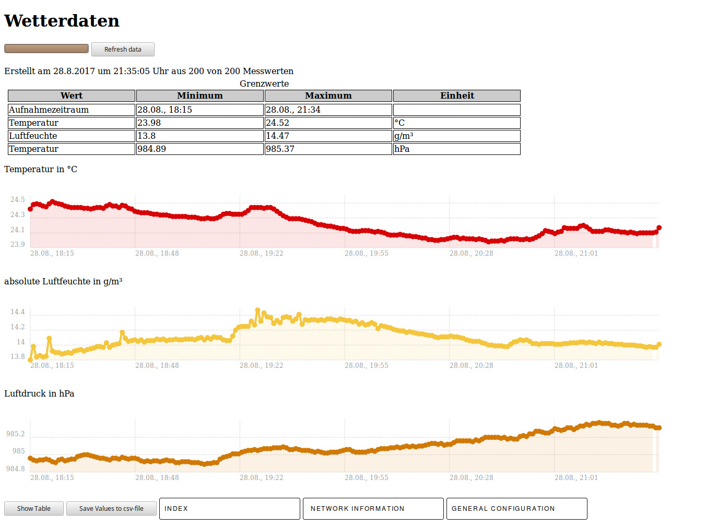

# esp-weather-logger

A manual fork from https://github.com/gmag11/FSBrowserNG and  https://github.com/species5618/MQTT_ESP8266

added support for bme280 sensors and improved data logging 

For a overview of implemented features please refer to the original work, it makes no sense to byte-copy a good documentation ;)

##Changes

#removals
* removed support for IO to some degree (free SDA and SCL for I2C)

#additions
* added support for bme280 sensors.

## Why?

Main goal of this fork was to implement a complete offline solution for data storage of past measurements.
Currently its possible to save 200 data points, each one consisting of a timestamp (UTC), temperature (°C), air pressure (hPa) and absolute humidity (g/m³ H2O).
The sample interval is adjustable. Sampled data can be viewed without connection to the internet, all scripts are hosted on the esp.
Acquired data can be downloaded as csv-formatted file for later analysis.

To create the charts [chartist](https://gionkunz.github.io/chartist-js/) is used.

## Dependencies
The project uses several libraries. After compilation no external server is needed.
